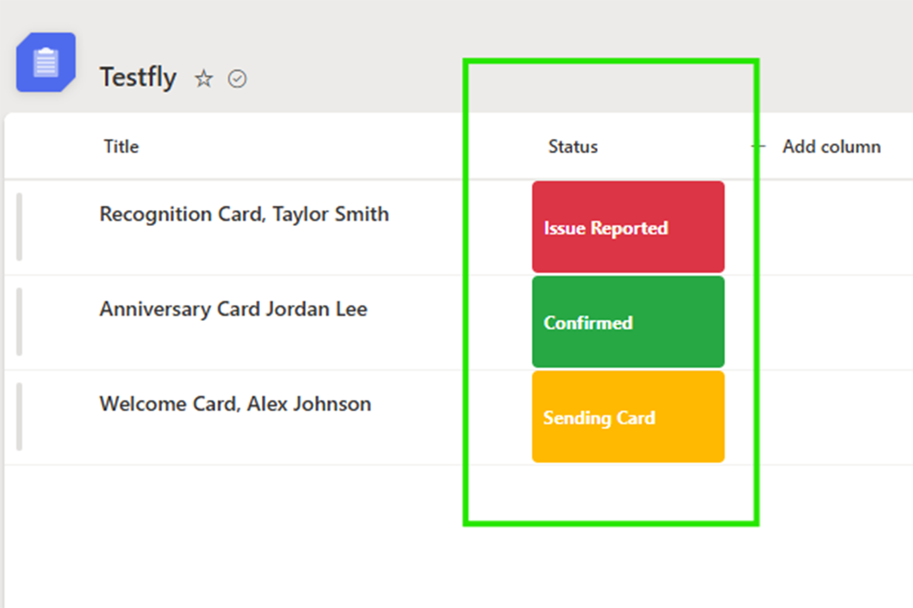

# Status Column Badges

This sample uses SharePoint column formatting to display status values as simple, color-coded badges. It provides a quick visual indicator that makes list items easier to scan.

## Features

* Displays each status as a centered badge
* Uses amber for **Sending Card**
* Uses green for **Confirmed**
* Uses red for **Issue Reported**
* Uses gray for any other or unexpected value
* Does not change the underlying list data
* Contains no tenant-specific or personal information

## Requirements

Create a SharePoint **Choice** column containing the following values:

* Sending Card
* Confirmed
* Issue Reported

The choice values must match exactly for the corresponding colors to appear.

## Installation

1. Create or open a SharePoint list.
2. Add a Choice column named **Status**.
3. Add the required choices listed above.
4. Open the Status column menu.
5. Select **Column settings** and then **Format this column**.
6. Select **Advanced mode**.
7. Copy the contents of [`status-column-badges.json`](./status-column-badges.json).
8. Paste the JSON into the formatting editor.
9. Select **Save**.

## Status Colors

| Status          | Color             |
| --------------- | ----------------- |
| Sending Card    | Amber (`#FFB900`) |
| Confirmed       | Green (`#28A745`) |
| Issue Reported  | Red (`#DC3545`)   |
| Any other value | Gray (`#808080`)  |

## Customization

You can customize the formatting by changing the status text or hexadecimal color values inside `status-column-badges.json`.

If you change a status name, make sure the value in the JSON exactly matches the corresponding SharePoint Choice value.
