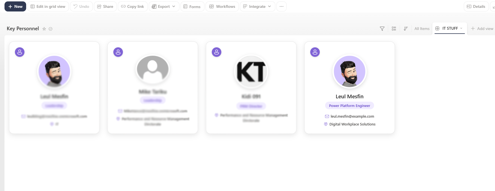

# Responsive People Profile Cards

## Summary

This sample transforms a SharePoint list Gallery view into modern, responsive people profile cards.

The cards use a clean Midnight and Slate color palette and display each person's Microsoft 365 profile picture, name, role, email address, and department. The formatting includes profile hover-card functionality and automatically hides optional information when it is unavailable.

No tenant-specific, organizational, or personal information is hardcoded into the JSON.

## View requirements

Create a SharePoint list containing the following columns:

| Column Display Name | Column Type | Internal Name | Required | Description |
| --- | --- | --- | --- | --- |
| Name | Person or Group | `Name` | Yes | Displays the person's Microsoft 365 profile picture and display name. Configure this column to allow only one person. |
| Title | Single line of text | `Title` | Yes | Used as a fallback when the Role column is empty. |
| Role | Single line of text | `Role` | No | Displays the person's role. Overrides Title when populated. |
| Email | Single line of text | `Email` | No | Displays a custom email address. If empty, the email from the Name person column is used. |
| Department | Single line of text | `Department` | No | Displays the person's department or team. |

## Sample

| Solution | Author |
| --- | --- |
| [responsive-people-profile-cards.json](./responsive-people-profile-cards.json) | [Leul Mesfin](https://github.com/LeulMesfin1) |

## How to use

1. Create or open a SharePoint list containing the required columns.
2. Create a new **Gallery** view.
3. Open the view menu and select **Format current view**.
4. Select **Advanced mode**.
5. Copy the contents of `responsive-people-profile-cards.json`.
6. Paste the JSON into the formatting editor.
7. Select **Save**.

## Features

- Responsive gallery-style profile cards
- Microsoft 365 profile pictures
- Native SharePoint person hover cards
- Clean Midnight and Slate color palette
- Role-to-title fallback
- Email fallback using the Name person column
- Automatically hidden optional fields
- No hardcoded tenant or personal information

## Customization

The primary colors can be changed by updating these values in the formatting JSON:

| Element | Color |
| --- | --- |
| Profile icon background | `#0f172a` |
| Card border | `#e2e8f0` |
| Role background | `#f1f5f9` |
| Bottom gradient | `#0f172a` to `#64748b` |

## Preventing scrollbars

When using the formatted list through a SharePoint List web part:

1. Edit the SharePoint page.
2. Edit the List web part.
3. Change the **Size** setting to **Autosize – fit to number of items**.

This allows the web part to expand based on the number of displayed profile cards.

## Version history

| Version | Date | Comments |
| --- | --- | --- |
| 1.0 | September 2026 | Initial release |

## Disclaimer

**THIS CODE IS PROVIDED AS IS WITHOUT WARRANTY OF ANY KIND, EITHER EXPRESS OR IMPLIED, INCLUDING ANY IMPLIED WARRANTIES OF FITNESS FOR A PARTICULAR PURPOSE, MERCHANTABILITY, OR NON-INFRINGEMENT.**

## Additional resources

- [Use view formatting to customize SharePoint](https://learn.microsoft.com/sharepoint/dev/declarative-customization/view-formatting)

